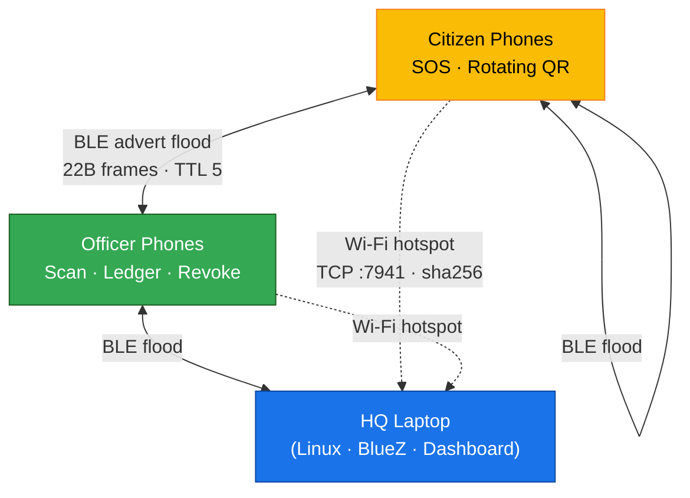
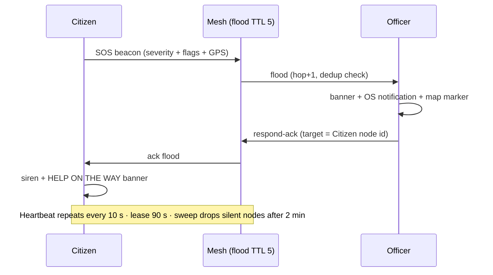
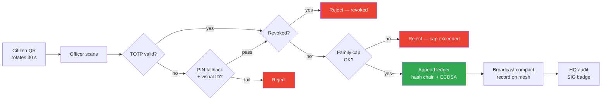
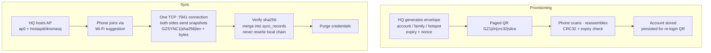

# GridZero — Technologies & Methodology

Version: 1.1 · Status: Active · Pure prose

---

*Updated 2026-08-28 to v1.1: HQ-signed `GZPROV`/`GZCERT` provision blocks fake accounts, `GZCHAT`/`GZANN1` signed chat/landmarks block bot spam, 7-bit English pack (249 chars), HQ-hosted `ap0` link + Windows `BluetoothLEAdvertisementPublisher` patch, `MeshMap` landmarks on HQ/citizen/officer maps. `24h` is QR validity only — accounts never expire, future internet login reuses same hash-derived key.*

---

## 1. Technologies To Be Used

### 1.1 Programming Languages

| Language | Role | Why Chosen |
|---|---|---|
| **Dart** | Primary app logic, protocol, crypto, storage | Single-language full stack with Flutter; null-safe, fast |
| **Kotlin (Android)** | Wi-Fi suggestion bridge, speakerphone forcing | Only way to call Android WifiNetworkSuggestion / AudioManager APIs |
| **Shell / System tooling** | HQ hotspot bring-up (nmcli, hostapd, dnsmasq, iw, nft) | Reuses standard Linux networking stack — no custom driver |
| **C (via FFI, indirect)** | BlueZ / D-Bus bindings on Linux | Underlying Bluetooth stack is C; Dart talks to it over D-Bus |

### 1.2 Frameworks & Libraries

| Category | Technology | Purpose |
|---|---|---|
| **Cross-platform app** | Flutter 3.x (Material 3) | One codebase for Android phones + Linux HQ |
| **BLE — Android** | flutter_blue_plus (central/scan) + ble_peripheral_plus (advertise) | Raw manufacturer-data advertisement mesh, no pairing |
| **BLE — Linux HQ** | BlueZ over D-Bus (bluez + dbus packages) | Same wire frames via desktop Bluetooth daemon |
| **Crypto** | crypto + pointycastle | SHA-256, HMAC-SHA256, ECDSA P-256 deterministic (RFC 6979) |
| **Storage** | sqflite / sqflite_common_ffi + shared_preferences | Ledger + face embeddings (SQLite), accounts (prefs JSON) |
| **Maps & Location** | flutter_map + latlong2 + geolocator + flutter_compass | OSM raster tiles, GPS, bearing — offline grid fallback |
| **Sensors** | sensors_plus (accelerometer) | Movement-gated GPS to save battery |
| **Vision / QR** | qr_flutter + mobile_scanner + zxing2 + flutter_lite_camera (Linux) | Citizen rotating QR, officer scanning, HQ provisioning QR |
| **Biometrics** | MobileFaceNet (tflite) + on-device face detection | 112×112 eye-aligned embedding, L2-normalised, local-only |
| **Notifications / Audio** | flutter_local_notifications + audioplayers | SOS banners, OS notifications, siren on respond-ack |
| **Theming** | dynamic_color | Material You seed theming on supported devices |

### 1.3 Hardware & Infrastructure

| Item | Minimum Spec | Notes |
|---|---|---|
| **Citizen / Officer phone** | Android 8+ with BLE 4.2, GPS, camera, accelerometer | Commodity phones — no special hardware. BLE 5 optional, not required |
| **HQ laptop** | Linux x64, Bluetooth 4.2+, Wi-Fi AP-capable adapter, sudo for hotspot | Any field laptop; MT7922-class adapters tested with coexistence handling |
| **No server / no cloud** | — | Fully air-gapped by design; HQ laptop *is* the server |
| **Power** | Power banks / camp generator sufficient | Duty-cycle governor targets <8%/day idle drain |

### 1.4 Tooling & DevOps

Dart analyzer + flutter test + widget tests; fake mesh adapter harness for radio-free CI; side-load APK distribution (no store dependency — critical when stores are unreachable).

---

## 2. Methodology & Process for Implementation

### 2.1 Development Methodology

**Iterative Incremental (Agile-light, camp-driven):**

1.  **Discover** — field interviews + disaster-response literature → PRD/SRS.
2.  **Prototype** — smallest mesh that beeps (2 phones relay one SOS).
3.  **Harden** — ledger, crypto, provisioning, sync — each behind a swappable adapter so hardware and logic evolve independently.
4.  **Field-trial loop** — deploy to a real camp or a dense-building drill, measure propagation/battery/claim-integrity, feed back into governor and frame budget.
5.  **Document-as-you-go** — every wire-format or crypto change lands in the docs folder before it lands in code.

Two-week sprints; each sprint must leave `flutter analyze` + `flutter test` green.

### 2.2 Phase-wise Implementation

| Phase | Duration | Deliverable | Exit Criteria |
|---|---|---|---|
| **P0 — Foundations** | 2 wks | Flutter shell, role model, SQLite ledger, account store | App boots on Android + Linux; accounts provisionable via QR |
| **P1 — Mesh MVP** | 3 wks | 22-byte codec, flooding relay (TTL 5), dedup LRU, CRC8, single-slot adv queue | 3 phones relay SOS 2 hops <15 s |
| **P2 — SOS & Radar** | 2 wks | Severity/flags, 90 s leases, heartbeat governor, radar bearing/RSSI, banners + OS notifications | SOS visible on peer map + radar; ack rings citizen phone |
| **P3 — Ration Ledger** | 3 wks | Rotating TOTP QR, PIN fallback, hash-chain append, ECDSA signing, daily duplicate guard, revocation diffusion | Scan→claim <10 s; duplicate next-day blocked; tampered record rejected |
| **P4 — Sync & HQ** | 2 wks | Wi-Fi hotspot link (TCP framing + sha256), dashboard map + heatmap, directories | One-tap two-way exchange completes; HQ shows live camp state |
| **P5 — Biometrics & Polish** | 2 wks | Face enrollment (MobileFaceNet), settings, DANGER ZONE, offline map fallback | Face re-enroll + sync round-trips; degraded sensors handled |
| **P6 — Field hardening** | Ongoing | Wire-level encryption/AEAD, at-rest key encryption, multi-day endurance, density testing | Security gaps in SRS §5 closed; 200-device soak |

### 2.3 Flow Charts & Diagrams

> **How to use this section in a PPT:** every figure below is 16:9, 1920×1080 export. Use white background, dark text, ≥14 pt labels, 2 pt stroke. Export mermaid as SVG/PNG at 300 dpi. Place one figure per slide with its caption as slide title. Alt-text is provided for accessibility.

#### Figure 1 — System Architecture (one slide)

*Image description for designer:* centered HQ laptop icon at top, two phone clusters below (left: Citizen phones, right: Officer phones) connected by dashed BLE waves labelled "Advertisement Flood (TTL 5)". A separate solid Wi-Fi arc from one phone to HQ labelled "Bulk Sync :7941 (swap + verify)". Legend bottom-right: dashed = BLE mesh, solid = Wi-Fi hotspot. Background: faint disaster-camp outline. PPT size: full-bleed 16:9, no cropping.

#### Figure 2 — SOS Lifecycle (one slide)

*Image description:* vertical swim-lane with three actors: Citizen, Mesh, Officer. Steps: Citizen taps SOS → broadcasts SOS beacon (severity+flags) → mesh floods → officer banner lights → officer taps Respond → ack floods back → citizen phone rings. Lease expiry loop on the side. Use red for SOS, green for ack, grey for mesh relay.

#### Figure 3 — Ration Claim Flow (one slide)

*Image description:* left-to-right pipeline: Citizen QR (rotating) → Officer scan → TOTP verify → fallback PIN+visual check if needed → revocation check → family-cap gate → ledger append (hash + sign) → wire broadcast (compact record) → HQ audit badge. Red X branches for each rejection. PPT layout: horizontal pipeline, diamond gates for decisions.

#### Figure 4 — Provisioning & Bulk Sync (one slide, two lanes)

*Image description:* split slide, left lane = provisioning, right lane = sync. Left: HQ generates envelope (type+expiry+nonce) → paged QR (CRC32) → phone reassembles → account stored. Right: HQ hosts AP → phone joins via suggestion → single TCP connection both-way snapshot swap → sha256 verify → import (never rewrite chain) → credentials purged. Icons: QR, Wi-Fi bubble, database.

#### Figure 5 — Development Timeline (one slide, Gantt-style)

*Image description:* horizontal bar chart with 6 phases (P0–P5) plus ongoing P6 in lighter shade. Milestone diamonds: "Mesh MVP beeps" after P1, "Ledger closes" after P3, "Camp demo" after P4. Use phase colours matching §2.2 table. PPT note: keep to one slide — if crowded, split into P0–P2 / P3–P6 two-slide sequence.

```mermaid
gantt
    title Implementation Timeline
    dateFormat  X
    axisFormat  P%X
    P0 Foundations       :0, 2
    P1 Mesh MVP          :2, 5
    P2 SOS & Radar       :5, 7
    P3 Ration Ledger     :7, 10
    P4 Sync & HQ         :10, 12
    P5 Biometrics        :12, 14
    P6 Field Hardening   :14, 18
```

### 2.4 Working Prototype — What Exists Today

A runnable Flutter app (Android + Linux) demonstrating:

- Live BLE advertisement mesh: phones discover each other, flood SOS, show peers on radar/map.
- Citizen screen: SOS severity/flags, rotating ration QR, GPS-or-peer-estimated location status.
- Officer screen: scan → verify → ledger append; revocation panel; respond-ack siren.
- HQ dashboard: mesh map, triage heatmap, ledger tail, signature badges, user/officer directories.
- Provisioning: HQ issues paged QRs for citizen/family/officer accounts; phones adopt via scan.
- Bulk sync: HQ-hosted Wi-Fi bubble, two-way hashed exchange, snapshot merge.
- Face enrollment: on-device MobileFaceNet capture, stored locally, synced only over explicit link.
- Test harness: fake mesh adapter + unit/widget suites covering codec, CRC, dedup, TOTP, ledger tamper rejection, flood behaviour.

In PPT terms: **live-demo slide** — show a 20-second screen recording of two phones: left phone raises SOS, right phone's radar lights up and an audible ack rings back. No mockup needed; real hardware demo.

### 2.5 Image / Slide Checklist for PPT

| Slide | Figure | File to create | Size |
|---|---|---|---|
| 1 | System architecture | `fig1-system-architecture.png` | 1920×1080, 16:9 |
| 2 | SOS lifecycle | `fig2-sos-lifecycle.png` | 1920×1080, 16:9 |
| 3 | Ration claim flow | `fig3-claim-flow.png` | 1920×1080, 16:9 |
| 4 | Provisioning + Sync (split) | `fig4-provision-sync.png` | 1920×1080, 16:9 |
| 5 | Gantt timeline | `fig5-timeline.png` | 1920×1080, 16:9 |
| 6 | Live demo | `demo-mesh-sos.mp4` or GIF | 1080×1920 (phone portrait) centred on 16:9 slide with blurred background |

Tip: export mermaid from https://mermaid.live → SVG → import into PowerPoint/Google Slides; it stays sharp when scaled.

---

## Layman Terms

**What tools are we using?**
A single phone-app language (Dart/Flutter) so one team builds both the handset and the laptop screens. Bluetooth tricks so phones can gossip without internet. Maths that makes receipts unforgeable and barcodes expire fast. Face-matching that runs entirely inside the phone. A Linux laptop that conjures a little private Wi-Fi bubble to copy databases securely. All commodity hardware — phones people already carry, plus one laptop.

**How do we build it?**
In small steps, proving each one works before adding the next: first just "phones see each other", then "SOS really reaches someone", then "food tickets can't be double-spent", then "laptop sees the whole camp", then polish. After every step, automated tests must stay green.

**What pictures should the slides show?**
Five clean diagrams, each filling one widescreen slide: how everything connects, how an SOS travels, how a food ticket goes from scan to receipt, how new accounts and bulk copying work, and a timeline bar showing the six build phases. Plus a short live video of two real phones: one shouts SOS, the other lights up and answers — proof it isn't just a mockup.
